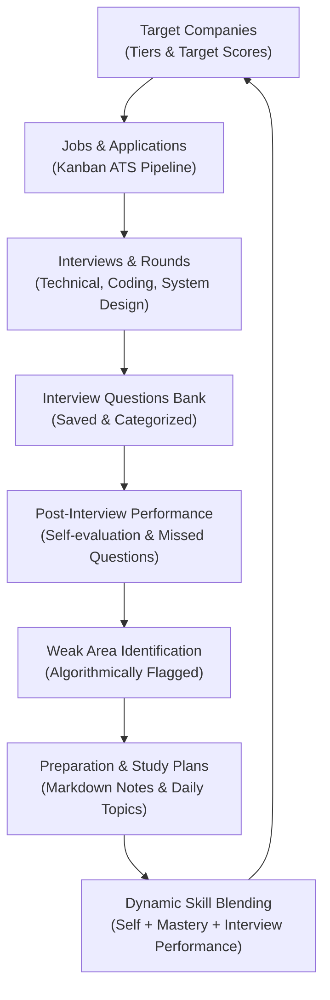
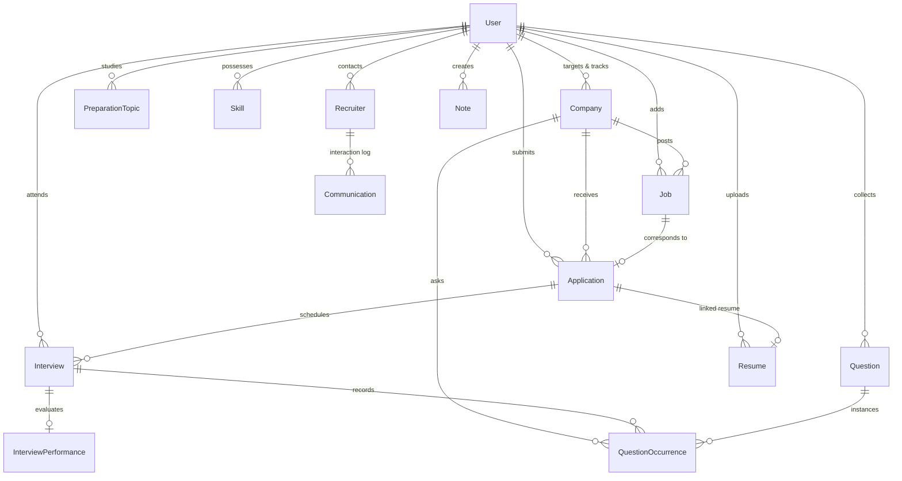

# LoopBoard — Complete Project History, Architecture & Flow

This document serves as the **permanent reference manual and memory bank** for LoopBoard. Whenever you or an AI assistant revisit this project after days, weeks, or months, this file provides the complete context, design philosophy, closed-loop product workflow, data schemas, mathematical scoring algorithms, and technical architecture so nothing ever needs to be re-explained.

---

## 1. Project Genesis & Core Mission

### Why LoopBoard Was Created
Traditional job search trackers are passive spreadsheets or simple CRUD tools (recording "Applied to Company X on Date Y"). They do not help the engineer get better or target smarter.

**LoopBoard is built on a fundamental premise:**
> A software engineer's job hunt is not a linear list; it is a **continuous feedback learning loop**. Every interview gives data about real company expectations, question patterns, and personal weak spots. That data must directly drive daily preparation, update skill scores, and re-rank which target companies you are genuinely ready to interview at next.

### The Product Feedback Loop


---

## 2. Technology Stack & Directory Layout

### Technology Stack
| Layer | Technologies Used | Key Responsibilities |
|---|---|---|
| **Frontend** | React 19, TypeScript, Vite, Tailwind CSS, Zustand, React Router v7, Recharts, Lucide Icons | Responsive SaaS UI, Kanban boards, interactive analytics, markdown prep viewer/editor, auth persistence |
| **Backend** | Node.js 20+, Express, TypeScript (`tsx` in dev), Zod validation schemas | REST API, Controller-Service-Repository architecture, centralized error handling |
| **Database & Cache** | MongoDB (Mongoose schemas with indexes), Redis (with auto fallback to in-memory cache in dev) | Relational references, multi-tenant `userId` scoping, question occurrences aggregation |
| **Authentication** | JWT Access Token (~15m in memory/Zustand) + Refresh Token (7-day `httpOnly` secure cookie at `/api/auth/refresh`) | Secure session management, bcrypt password hashing, automatic token rotation |
| **File Storage** | Multer disk storage in `server/uploads/resumes` | Storing and associating PDF/DOCX resumes with specific applications |

### Workspace Directory Layout
```
LoopBoard/
├── .agents/
│   └── rules/
│       └── loopboard-context.md      # Auto-loaded AI rule for Antigravity & assistants
├── AGENTS.md                          # Root-level AI memory & context guide
├── PROJECT_HISTORY_AND_FLOW.md        # This master document
├── README.md                          # Quickstart developer guide
├── notes                              # Initial requirements & product design blueprint
├── prep-notes/                        # Markdown study material categorized by stack
│   ├── javascript/
│   ├── typescript/
│   ├── react/
│   ├── nodejs/
│   ├── express/
│   ├── mongodb/
│   ├── system-design/
│   ├── dsa/
│   └── other/
├── client/                            # Vite + React Frontend
│   └── src/
│       ├── components/                # Reusable UI primitives (buttons, modals, badges, kanban)
│       ├── layouts/                   # ProtectedLayout, GuestLayout, Sidebar, TopNav
│       ├── pages/                     # Routed pages (Dashboard, Applications, Companies, Interviews, etc.)
│       ├── services/                  # Axios API client instances with token refresh interceptors
│       ├── store/                     # Zustand stores (`auth.ts`, `ui.ts`)
│       ├── types/                     # Shared TypeScript interfaces
│       └── utils/                     # Formatting, score helpers, class merging
└── server/                            # Express Backend
    ├── uploads/resumes/               # Uploaded resume documents
    └── src/
        ├── ai/                        # AI integration port/adapter abstractions
        ├── config/                    # Environment variables, database, redis configuration
        ├── constants/                 # Scoring weights, mastery scales, status enums
        ├── controllers/               # HTTP request handlers (authController, appControllers)
        ├── middleware/                # Auth verification, Zod validation, error handling, rate limiting
        ├── models/                    # Mongoose schemas (18 models)
        ├── repositories/              # Database query abstraction layer
        ├── routes/                    # Express REST route declarations (`/api/*`, `/api/auth/*`)
        ├── services/                  # Business logic & scoring engines
        └── validators/                # Zod request payload schemas
```

---

## 3. Core Modules & End-to-End User Flow

### 1. Authentication & Profile
- **Routes**: `/login`, `/register`, `/forgot-password`, `/reset-password`, `/settings`
- **Behavior**:
  - Registration automatically seeds default prep topics across major technologies.
  - Access token stored in memory via Zustand store; refresh token stored in `loopboard_refresh` httpOnly cookie.
  - User profile includes Target Role, Years of Experience (YOE), Expected Salary, Preferred Work Mode (remote/hybrid/onsite), and Skills.

### 2. Company Management & Targeting
- **Routes**: `/companies`, `/companies/:id`, `/targets`, `/companies/compare`
- **Features**:
  - Companies categorized into **Tier 1** (Dream/FAANG), **Tier 2** (Strong product), **Tier 3** (General).
  - Target Status: `target`, `high_priority`, `medium_priority`, `low_priority`, `applied`, `interviewing`, `offer`, `rejected`, `not_interested`.
  - **Company Target Score**: Multi-factor algorithm computing overall fit percentage (0-100%).
  - Company comparison tool allowing side-by-side evaluation of requirements, difficulty, and your readiness.

### 3. Job Search & ATS Kanban Tracker
- **Routes**: `/applications`, `/jobs`
- **Features**:
  - **Kanban Pipeline**: `Saved` → `Applied` → `Screening` → `Interview Scheduled` → `Interviewing` → `Offer` → `Rejected`.
  - Also handles terminal non-board states: `Withdrawn` and `Closed`.
  - Drag-and-drop or dropdown status updates trigger automatic activity logs.
  - Links applications directly to job descriptions, target salary, recruiter contact, and specific resume versions.

### 4. Interview Management & Detailed Rounds
- **Routes**: `/interviews` (Upcoming / History), `/interviews/:id`
- **Features**:
  - Tracks specific interview rounds: HR, Recruiter, Technical, Coding, System Design, Managerial, Behavioral, Final Round.
  - Records meeting link, interview date/time, interviewer names, difficulty, and round outcome (`Pending`, `Passed`, `Failed`, `Rescheduled`, `Cancelled`).
  - Round detail page houses linked questions, performance ratings, and interview-specific notes.

### 5. Post-Interview Performance Evaluation
- **Feature**: After each interview round, the user records:
  - Technical Score (1-5 or 0-100%)
  - Communication Score
  - Confidence Level
  - Questions Answered vs Questions Missed
  - Qualitative notes: "What went well", "What went wrong", "What to improve"
- **Output**: The system immediately generates **"What Should I Prepare Next?"** by identifying which topics caused difficulties.

### 6. Canonical Question Bank & Occurrences
- **Routes**: `/questions`
- **Features**:
  - Canonical question deduplication via `Question` and `QuestionOccurrence`.
  - Tracks how many different companies asked the exact same or related question (e.g. "Explain Event Loop" asked by 7 companies).
  - Categorized by Technology (JavaScript, React, Node.js, Express, MongoDB, SQL, System Design, DSA, AWS, Docker, Redis, Git, Behavioral).
  - Tracks personal confidence (1 to 5) and mastery status (`not_studied`, `studying`, `weak`, `good`, `mastered`).

### 7. Preparation Engine & Stack Notes Hub
- **Routes**: `/prep/topics`, `/prep/notes`, `/prep/notes/:stack`, `/prep/plan`, `/prep/weak`
- **Features**:
  - **Prep Stacks**: Direct integration with the `prep-notes/` markdown files. Users can read, search, and edit deep study notes inside the web portal.
  - **Weak Areas Dashboard**: Automatically aggregates topics and questions with low confidence or failing scores.
  - **Study Plan Generator**: Dynamically generates prioritized study plans based on the next target company's job requirements and the user's historical weak areas.

### 8. Analytics & Dashboard Intelligence
- **Routes**: `/`, `/analytics`
- **Features**:
  - Real-time conversion funnel: Applications → Screenings → Technical Interviews → Offers.
  - Applications and interview activity over time (via Recharts).
  - Most frequently asked questions and most demanded technologies.
  - Proactive Insights: Displays strongest area, weakest area, top-matching companies, and next recommended action.

### 9. Workspace Tools (Recruiters, Resumes, Notes, Calendar)
- **Recruiters**: Contact directory with communication timeline (emails, calls, follow-up dates).
- **Resumes**: Version management (e.g. MERN Fullstack vs Backend Go) with file uploads and application associations.
- **Notes**: Global polymorphic notes linked to companies, jobs, interviews, questions, or topics.
- **Calendar**: Unified schedule of upcoming interviews, preparation milestones, and follow-up deadlines.

---

## 4. Proprietary Intelligence & Scoring Formulas

The intelligence algorithms reside in `server/src/constants/scores.ts` and `server/src/services/targetingService.ts`:

### A. Company Target Score (Composite Fit: 0-100%)
$$\text{Target Score} = 0.35 \times \text{SkillMatch} + 0.20 \times \text{ExperienceMatch} + 0.25 \times \text{InterviewReadiness} + 0.20 \times \text{CompanyInterest}$$

1. **Skill Match (35%)**:
   - Compares the company's required skills (with optional weights) against the user's **Blended Skill Scores**.
2. **Experience Match (20%)**:
   - Ratio of user's years of experience to the job's required experience: $\min(100, (\text{User YOE} / \text{Required YOE}) \times 100)$.
3. **Interview Readiness (25%)**:
   - Calculated from the user's prep topic completion % and question mastery in the technologies required by that company.
4. **Company Interest (20%)**:
   - Base interest rating (1-5 scaled to 0-100%) + Tier bonus (Tier 1: +10%, Tier 2: +5%) + Priority offset.

### B. Blended Skill Score
Instead of relying solely on self-assessment, each skill score blends three sources:
$$\text{Blended Score} = 0.40 \times \text{SelfScore} + 0.35 \times \text{QuestionMastery} + 0.25 \times \text{InterviewPerformance}$$

- **Question Mastery**: Computed from questions tagged with this skill:
  $$\text{Mastery Score} = \frac{\text{StatusScore} + (\text{Confidence} \times 20)}{2}$$
  - Status weights: `not_studied` = 0, `studying` = 30, `weak` = 40, `good` = 75, `mastered` = 100.
- **Interview Performance**: Average score across interview rounds testing this skill.

### C. Weak Topic Thresholds
A topic is automatically flagged as **Weak / Needs Preparation** if:
- Blended Skill Score $< 55\%$
- Confidence $\le 2$ (out of 5)
- Frequently missed in actual interviews or question bank.

---

## 5. Database Schema & Relationships

All models live in `server/src/models/` and are scoped by `userId` for data isolation:



---

## 6. How to Run Locally

### Prerequisites
- Node.js version **20+**
- MongoDB (Atlas connection string or local MongoDB instance)
- Redis (optional in development; auto-falls back to memory)

### Server
```bash
cd server
cp .env.example .env     # Ensure MONGODB_URI and JWT secrets are filled
npm install
npm run dev              # Runs on http://localhost:5000 via tsx
```

### Client
```bash
cd client
npm install
npm run dev              # Runs on http://localhost:5173 (proxies /api to localhost:5000)
```

---

## 7. Rules for Future Development & AI Pair Programmers

When working on LoopBoard, adhere strictly to these rules:

1. **Preserve the Closed Feedback Loop**:
   - Any new feature related to questions, interviews, or preparation must feed back into skill scores, weak topics, or company target readiness.
2. **Architecture Separation**:
   - Keep business logic in `server/src/services/`. Express controllers should only handle request parsing and response delivery.
   - Database operations should utilize `server/src/repositories/` or direct model queries within services.
   - Frontend components should remain clean; complex API calls and global states go in `services/` and `store/`.
3. **TypeScript Strictness**:
   - Avoid `any`. Use proper interfaces and Zod validators in `server/src/validators/` for every API endpoint.
4. **Consistency**:
   - Maintain the standardized JSON response structure:
     `{ success: true, data: ..., message?: string }`
     `{ success: false, message: string, error?: ... }`
5. **Aesthetics & UX**:
   - LoopBoard is a premium, modern developer SaaS portal. Keep the UI polished with sleek cards, subtle transitions, responsive layouts, badges, and informative empty/loading states.
